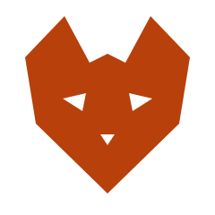

<div align="center">



# Wolf *of* Claude

**Build loud. Ship faster than they can copy.**

*Apps, Web3, founder life. Building with AI in public, with Claude as the second brain.*

[](https://wolfofclaude.com)
[](https://tiktok.com/@wolfofclaude)
[](https://x.com/wolfofclaude)

</div>

---

## The brand

Wolf of Claude is what happens when you stop asking permission and start shipping in front of everyone. It is the live channel of building with AI: apps, Web3 plays, lifestyle, and the kind of velocity that gets you flagged for cheating.

The site is the home base. Everything else (TikToks, reels, threads, essays, the letter) feeds back into it.

## Palette

<div align="center">


</div>

## Typography

| Role     | Family            | Weight   | Notes                                  |
|----------|-------------------|----------|----------------------------------------|
| Display  | **Fraunces**      | 500, 600 | Italic for emphasis. Headlines only.   |
| UI / Body | **Inter**         | 400, 500 | All paragraph & navigation copy.       |
| Utility  | **JetBrains Mono**| 500      | Numerics, hex, technical labels.       |

## Tech stack

<div align="center">


</div>

## Run it

```powershell
git clone https://github.com/wolfofclaude/wolfofclaude.com.git
cd wolfofclaude.com
npm install
npm run dev
```

Then open http://localhost:3000.

## What is inside

```
app/
  layout.tsx     Root layout, fonts, metadata
  page.tsx       The single page composition
  globals.css    Tailwind theme, animations, utilities
components/
  Nav            Sticky nav with the spark mark
  Hero           Build loud. Ship faster than they can copy.
  Marquee        The brand voice on rotation
  Manifesto      The thesis
  Numbers        The wolf in numbers
  Work           Selected transmissions
  Beats          The four beats: AI, Web3, Apps, Life
  Stack          The toolbox (affiliate ready)
  Coach          Work with me, three tiers
  Letter         The Sunday letter signup
  Social         Where the noise lives
  SiteFooter     Brand mark and links
  ScrollProgress Thin ember line at the top
  ScrollReveal   Fade up on enter
  Spark          The mark as a React component
public/
  spark, favicon, app-icon, brand glyphs
```

## Edit the words

All copy lives inline in the component files. Open the file, change the JSX text. No CMS, no headless, no nonsense.

- Hero headline & sub: `components/Hero.tsx`
- Manifesto: `components/Manifesto.tsx`
- The numbers: `components/Numbers.tsx`
- Work cards: `components/Work.tsx`
- The four beats: `components/Beats.tsx`
- The toolbox & affiliate links: `components/Stack.tsx`
- Coach tiers & pricing: `components/Coach.tsx`
- Newsletter copy: `components/Letter.tsx`
- Social handles: `components/Social.tsx`

## Deploy

Push to `main`, Vercel rebuilds. The whole site is statically prerendered (`○ Static`), so cold starts are near zero and CDN response times are sub-100ms globally.

Set one env var on Vercel:

```
NEXT_PUBLIC_SITE_URL=https://wolfofclaude.com
```

This makes OG image URLs resolve absolutely, which matters for link previews on TikTok, Instagram, and X. That is the virality fuel.

## License

Brand and mark are owned by Wolf of Claude. Code is yours to read and learn from, but please do not copy the brand identity. Build your own loud.

---

<div align="center">


*Build loud. Ship faster than they can copy.*

**[wolfofclaude.com](https://wolfofclaude.com)** &middot; **[TikTok](https://tiktok.com/@wolfofclaude)** &middot; **[Instagram](https://instagram.com/wolfofclaude)** &middot; **[X](https://x.com/wolfofclaude)** &middot; **[YouTube](https://youtube.com/@wolfofclaude)**

<br/>

`MMXXVI`

</div>
